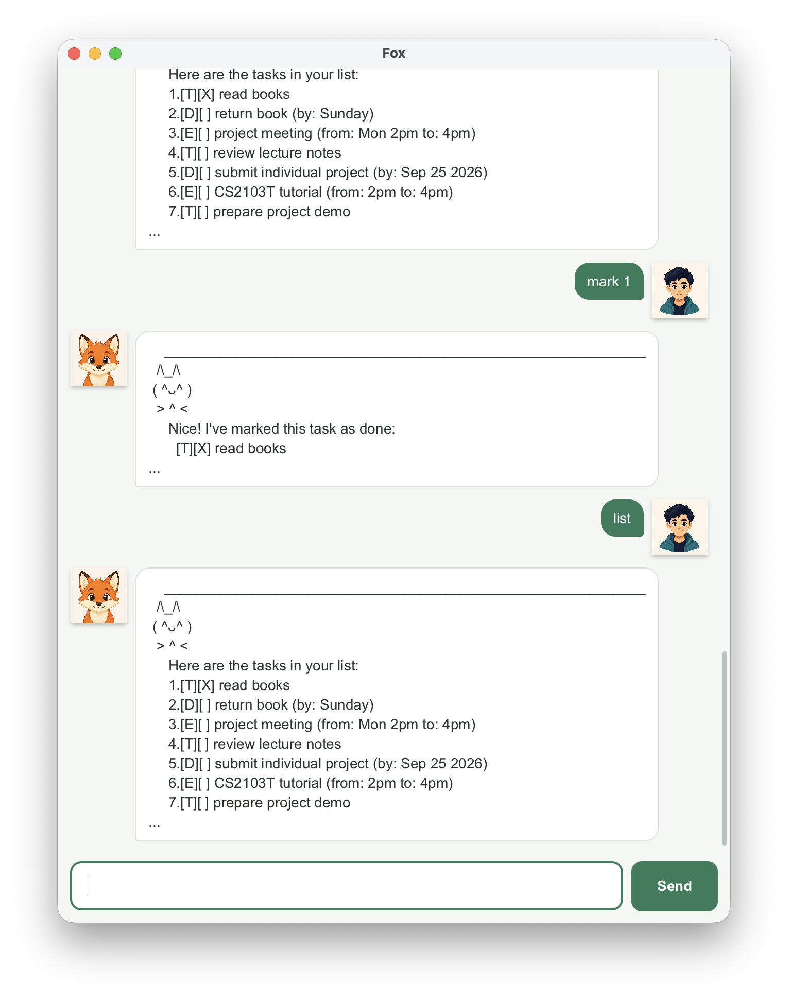

# Fox User Guide

Fox is a friendly desktop task manager that helps you keep track of to-dos,
deadlines, and events through simple text commands.



## Quick start

1. Ensure that Java 25 is installed on your computer.
2. Download `fox.jar` from the
   [latest Fox release](https://github.com/ZhangHanzhongFox/ip/releases).
3. Move `fox.jar` into an empty folder that Fox can use to store its data.
4. Open a terminal in that folder and run `java -jar fox.jar`.
5. Type a command in the input box, then press <kbd>Enter</kbd> or click **Send**.

Fox saves your tasks automatically in `data/fox.txt` in the folder from which
you started the application. Avoid editing this file manually.

## Reading the task list

Fox uses the following symbols:

| Symbol | Meaning |
| --- | --- |
| `[T]` | To-do |
| `[D]` | Deadline |
| `[E]` | Event |
| `[X]` | Completed task |
| `[ ]` | Incomplete task |

Words in `UPPER_CASE` in the command formats below are values that you supply.
Commands and parameter names are case-insensitive.

## Command summary

| Action | Command format |
| --- | --- |
| Show all tasks | `list` |
| Add a to-do | `todo DESCRIPTION` |
| Add a deadline | `deadline DESCRIPTION /by YYYY-MM-DD` |
| Add an event | `event DESCRIPTION /from START /to END` |
| Find tasks | `find KEYWORD [MORE_KEYWORDS]` |
| Mark a task as completed | `mark TASK_NUMBER` |
| Mark a task as incomplete | `unmark TASK_NUMBER` |
| Delete a task | `delete TASK_NUMBER` |
| Exit Fox | `bye` |

## Viewing all tasks: `list`

Shows every saved task and its current task number.

Format: `list`

> Task numbers can change after a task is deleted. Run `list` before using a
> task number if you are unsure.

## Adding a to-do: `todo`

Adds a task that does not have a specific date or time.

Format: `todo DESCRIPTION`

Example:

```text
todo review lecture notes
```

## Adding a deadline: `deadline`

Adds a task that must be completed by a specific date.

Format: `deadline DESCRIPTION /by YYYY-MM-DD`

Example:

```text
deadline submit project report /by 2026-09-25
```

Dates must use the `YYYY-MM-DD` format and must be real calendar dates. Fox
displays the example above as `(by: Sep 25 2026)`.

## Adding an event: `event`

Adds a task with a start and end time.

Format: `event DESCRIPTION /from START /to END`

Example:

```text
event CS2103T tutorial /from 2pm /to 4pm
```

Accepted time formats include `10am`, `10:30am`, and `22:30`. The end time must
be later than the start time. Specify `/from` and `/to` exactly once each.

## Finding tasks: `find`

Shows tasks whose descriptions contain at least one supplied keyword as a
complete word. Matching is case-insensitive, and results retain their original
task numbers.

Format: `find KEYWORD [MORE_KEYWORDS]`

Example:

```text
find report tutorial
```

This finds tasks containing either `report` or `tutorial`. For example,
searching for `book` finds `return book`, but not `booklet`.

## Marking a task as completed: `mark`

Marks the task at the given task number as completed.

Format: `mark TASK_NUMBER`

Example: `mark 2`

## Marking a task as incomplete: `unmark`

Marks the task at the given task number as incomplete again.

Format: `unmark TASK_NUMBER`

Example: `unmark 2`

## Deleting a task: `delete`

Permanently removes the task at the given task number.

Format: `delete TASK_NUMBER`

Example: `delete 2`

## Exiting Fox: `bye`

Closes Fox safely. Your task changes have already been saved automatically.

Format: `bye`

## Important behavior

* Fox can store up to 100 tasks.
* Leading, trailing, and repeated spaces in task descriptions are normalized.
* Fox rejects a new task if another task has the same type and details. Marking
  a task as completed does not make it a different task.
* Commands that require a task number accept one positive whole number only.
* If Fox cannot load or save its data file safely, it blocks task changes to
  avoid silently losing data and displays an error message.

## Troubleshooting

**Fox says it cannot find a task.**

Run `list` and use one of the task numbers currently shown.

**Fox rejects a deadline date.**

Use a real date in `YYYY-MM-DD` format, such as `2026-12-02`.

**Fox rejects an event time.**

Use a supported format such as `10am`, `10:30am`, or `22:30`, and ensure the
end time is later than the start time.

**Fox reports that the task already exists.**

Change the task details or use the existing task. Completed tasks are still
checked for duplicates.

## Acknowledgements

Parts of Fox's JavaFX GUI were adapted from the
[SE-EDU JavaFX tutorial](https://se-education.org/guides/tutorials/javaFx.html):

* [Part 1](https://se-education.org/guides/tutorials/javaFxPart1.html) guided
  the JavaFX launcher and cross-platform Gradle dependency setup.
* [Part 4](https://se-education.org/guides/tutorials/javaFxPart4.html) guided
  the FXML controller and dialog-box interaction structure.
* [Part 5](https://se-education.org/guides/tutorials/javaFxPart5.html) provided
  the basis for the initial CSS styling.

These parts were subsequently customized for Fox.
